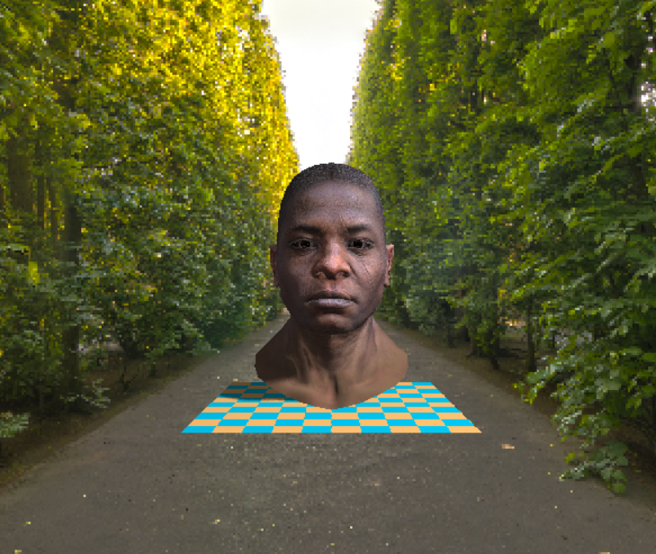
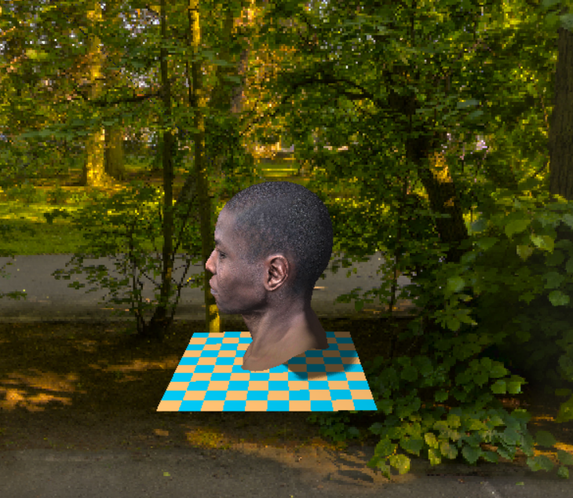
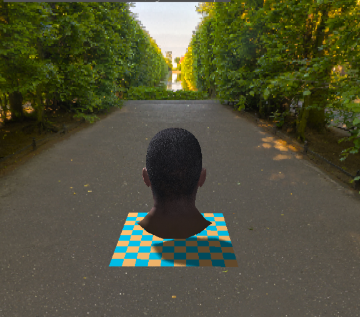
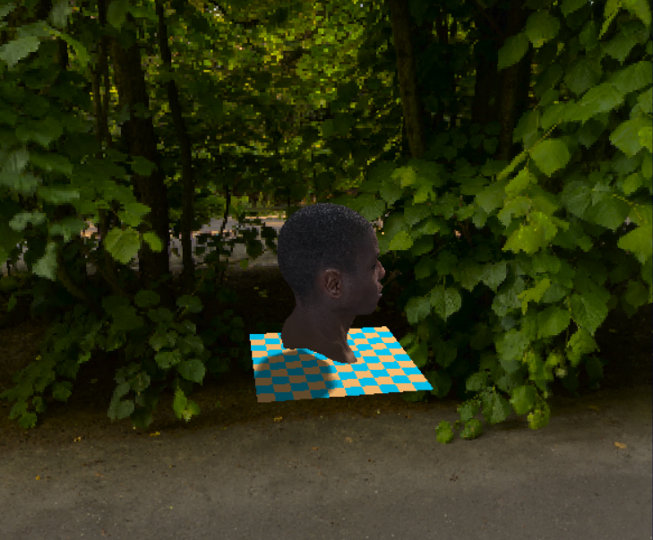
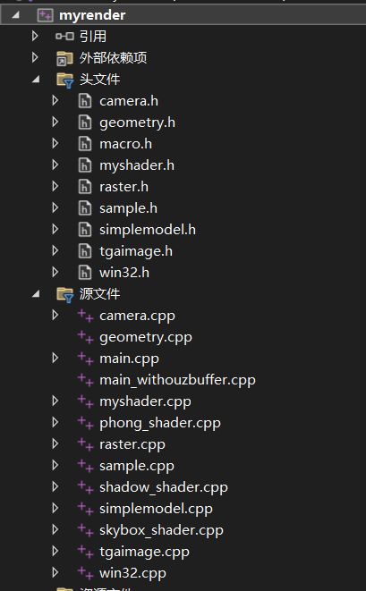
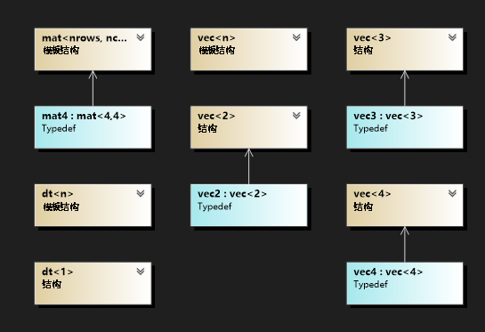
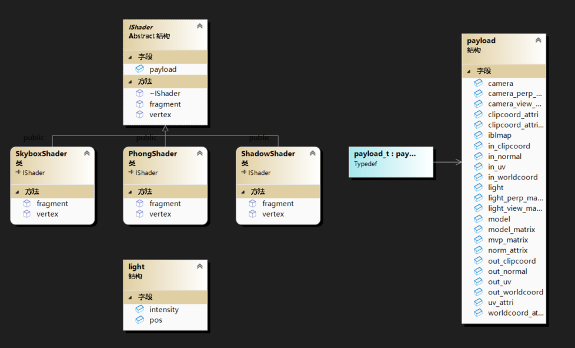
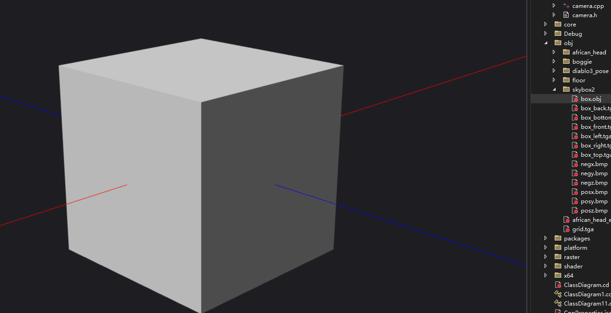
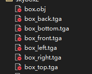

# myrender

# 实现效果

　　​​​​

　　​​​​

　　​​​​

　　​​​​

# 文件介绍

　　项目文件结构为：

　　​​

　　其中geometry.h定义了数学工具，代码类的结构如图所示，包含矩阵和向量的模板定义，以及运算符的重载和常用的函数

　　​​

　　macro.h定义了一些全局变量

```c++
#pragma once
#define PI 3.1415926
#define MAX_MODEL_NUM 10
#define MAX_VERTEX 10
#define EPSILON 1e-5f
#define EPSILON2 1e-5f
```

　　win32.h和win32.cpp是用来在window上渲染窗口，实现每一帧刷新显示。

# 代码介绍

　　主函数的代码为：

```c++
int main(int argc, char** argv) {
    //初始化相机和mvp矩阵
    //窗口初始化
    //循环渲染
    //初始化不同的shader
    //加载场景
    //循环渲染窗口
    while (!window->is_close)
    {

        //清空缓存
        //根据鼠标移动 更新mvp矩阵
        handle_events(camera);
        update_matrix(camera, view_mat, perspective_mat, shader_model, shader_skybox);
        //渲染天空盒
        renderSky(model_sky, shader_skybox);
        //生成shadowmap
        renderShadow(models,shader_shadow);
        //渲染场景
        renderScene(models,shader_model);
        //把帧缓冲颜色输出到窗口
    }

}

```

　　按照函数执行的顺序来介绍代码架构。

### Camera

　　在代码中首先初始化相机，相机的定义为：

```c++
class Camera {
public :
	Camera(vec3 e, vec3 t, vec3 up, float aspect);
	~Camera();
	vec3 eye;
	vec3 target;
	vec3 up;
	vec3 x;
	vec3 y;
	vec3 z;
	float aspect;
};
```

　　eye代表观察点，target代表看向的方向，up表示正上方。

　　同过 up和叉乘可以计算出相机的坐标，x，y，z

```

void update_camera_pos(Camera& camera);
void handle_events(Camera& camera);
  
```

　　通过鼠标的移动来修改eye和target从而达到更新视角的效果。

### Shader

　　**​ OpenGL中由顶点数据输入到绘制出一幅图像的具体过程为：**

　　(1) vbo将数据存储到缓存中，vao绑定顶点属性关系，然后vbo将缓存数据传给vertex_shader；

　　(2) 在顶点着色器中进行坐标变换，由mvp矩阵将其转换到裁剪坐标系，以及顶点着色；

　　(3) 然后到了图元装配阶段，将顶点着色器的输出数据装配成指定图元的形状，之后还有一个可选的几何着色器阶段，将输入的点或线扩展成多边形；

　　（注意，这个地方的表述正是和平常的图形渲染管线不一致的地方，这里应该是将图形渲染管线中的三角形设定或者说图元组装阶段表述为图元装配阶段，然后下面的光栅化阶段就是三角形遍历阶段）

　　(4) 然后到裁剪和屏幕映射阶段；裁剪掉视体外的图元，将当前坐标映射到屏幕坐标；

　　(5) 然后进入光栅化阶段，找到哪些像素被三角形覆盖，以及进行插值计算；

　　(6) 然后进入到了fragment_shader，执行光照计算，进行着色；

　　(7) 最后进入到测试混合阶段，包括Alpha测试、模板测试、深度测试等，然后进行混合。

　　实现的软光栅渲染器模仿这一过程，提取抽象出Shader模块，Shader中包含顶点着色器和片段着色器。

```c++
struct IShader {
    virtual ~IShader()=0;
    payload_t payload;
    virtual void vertex(int iface, int nthvert) = 0;
    virtual vec3 fragment(vec3 bar) = 0;
  
};
```

　　IShader就是接口，通过实现接口来实现不同的Shader，包括Phong着色模型的PhongShader，实现阴影映射的ShadowShader，实现天空盒的SkyboxShader。

　　payload里包含了顶点属性信息、光照信息、相机、模型、矩阵等等信息，方便访问。

　　​​​​

　　顶点着色器的核心主要是做了顶点变换这件事

```c++
vec4 temp_vert = to_vec4(payload.model->vert(nfaces, nvertex));
payload.clipcoord_attri[nvertex] = payload.mvp_matrix * temp_vert;
```

　　片元着色器的核心就是根据重心坐标差值计算属性（注意透视矫正），然后返回颜色

　　数学推导：[计算机图形学六：透视矫正插值和图形渲染管线总结 - 知乎 (zhihu.com)](https://zhuanlan.zhihu.com/p/144331875)

　　以插值得到世界坐标为例：

```c++
vec3* world_coords = payload.worldcoord_attri;
//根据重心插值计算属性 注意透视矫正  
float Z = 1.0 / (alpha / clip_coords[0].w + beta / clip_coords[1].w + gamma / clip_coords[2].w);
vec3 worldpos = (alpha * world_coords[0] / clip_coords[0].w + 
		beta * world_coords[1] / clip_coords[1].w +
		gamma * world_coords[2] / clip_coords[2].w) * Z;
```

### 齐次空间裁剪

　　理论推导：[计算机图形学补充2：齐次空间裁剪(Homogeneous Space Clipping) - 知乎 (zhihu.com)](https://zhuanlan.zhihu.com/p/162190576)

　　体现在代码中主要是四个函数

　　homo-clipping调用clip_with_plane实现逐视锥体平面裁剪，每个平面通过is_inside_plane判读是否满足在面内，如果出现要分割的情况就通过get_intersect_ratio计算交点，保存新的点。

　　裁剪后更新属性

```c++
static void transform_attri(payload_t& payload, int index0, int index1, int index2)
{
    std::vector<int> indexs{index0,index1,index2};
    for (int i = 0; i < 3; i++) {
        payload.clipcoord_attri[i] = payload.out_clipcoord[indexs[i]];
        payload.worldcoord_attri[i] = payload.out_worldcoord[indexs[i]];
        payload.norm_attrix[i] = payload.out_normal[indexs[i]];
        payload.uv_attri[i] = payload.out_uv[indexs[i]];
    }
}

```

　　然后接下来进行屏幕映射，光栅化，计算颜色，深度测试。

　　首先通过齐次除法转为标准设备坐标，然后进行视口转换，保留裁剪空间中的w值用来计算深度缓冲

### 背面剔除

1. 计算有向面积（signed_area）值。有向面积实际上是通过计算三角形的有向面积来判断其是顺时针还是逆时针排列的。如果有向面积为正，表示三角形按逆时针方向排列，而如果为负，表示三角形按顺时针方向排列。
2. 如果有向面积小于等于0，则表示三角形的顶点在逆时针方向排列，即背向观察者。这意味着三角形的正面不会朝向观察者，因此可以剔除这个三角形，不进行渲染

### 光栅化

　　一个面元包含不同的小像素，但只知道三个顶点的坐标，所以要插值计算属性。

　　首先需要计算重心坐标，然后传入片元着色器进行计算，最后更新缓冲。

```c++
    //光栅化 
    for (int x = static_cast<int>(xmin); x <= static_cast<int>(xmax); x++)
    {
        for (int y = static_cast<int>(ymin); y <= static_cast<int>(ymax); y++)
        {
            //计算重心坐标
            vec3 bar = compute_barycentric2D(static_cast<float>(x + 0.5), static_cast<float>(y + 0.5), screen_pos);
            //判读在当前点在三角形范围内
            if (bar.x>0&&bar.y>0&&bar.z>0) {
                int index = get_index(x, y);
                //透视正确的z插值 深度缓冲
                float normalizer = 1.0 / (bar.x / clipcoord_attri[0].w + bar.y / clipcoord_attri[1].w + bar.z / clipcoord_attri[2].w);
                float z = (bar.x * screen_pos[0].z / clipcoord_attri[0].w + bar.y * screen_pos[1].z / clipcoord_attri[1].w + bar.z * screen_pos[2].z / clipcoord_attri[2].w)* normalizer;
        
  
                if (zbuffer[index] > z) {
                    zbuffer[index] = z;
                    vec3 color = shader.fragment(bar);

                    for (int i = 0; i < 3; i++) {
                        c[i] = static_cast<int>(float_clamp(color[i], 0.0f, 255.f));
                     
                    }
                    set_color(framebuffer, x, y, c);
                }

            }

        }
    }
```

## 实现阴影映射

　　采用shadowmap，需要渲染两次，一次正常渲染场景，另外一次从光源位置作为观察方向渲染得到shadowmap

　　shadow的shader很简单：

```c++
void ShadowShader::vertex(int nfaces, int nvertex)
{
	vec4 temp_vert = to_vec4(payload.model->vert(nfaces, nvertex));
	payload.clipcoord_attri[nvertex] = payload.mvp_matrix * temp_vert;

}

vec3 ShadowShader::fragment(vec3 bar) {
	return { 0,0,0 };
}
```

　　实际实现中为了使用方便没有真正实现shadowmap保存在图片，而是使用了数组来存

```c++
if (bar.x > 0 && bar.y > 0 && bar.z > 0) {
    int index = x + y * WIDTH;
    float normalizer = 1.0 / (bar.x / clipcoord_attri[0].w + bar.y / clipcoord_attri[1].w + bar.z / clipcoord_attri[2].w);
    float z = (bar.x * screen_pos[0].z / clipcoord_attri[0].w + bar.y * screen_pos[1].z / clipcoord_attri[1].w + bar.z * screen_pos[2].z / clipcoord_attri[2].w) * normalizer;
    if (shadowbuffer[index] > z) {
        shadowbuffer[index] = z;
    }
}
```

　　‍

　　在得到shadowmap后，通过比较深度就可以得到阴影

```c++
//1、直接使用插值后的世界坐标计算
vec4 light_clip_pos = payload.light_perp_matrix * payload.light_view_matrix * to_vec4(worldpos);
vec3 screen_pos_light{ 0.5 * (WIDTH ) * (light_clip_pos.x + 1.0),0.5 * (HEIGHT ) * (light_clip_pos.y + 1.0),light_clip_pos.z };
int index = int(screen_pos_light.x+0.5) + int(screen_pos_light.y+0.5) * WIDTH;
float cur_shadow_depth = -light_clip_pos.z;
float shadow = 0.f;
float bias = float_max(0.5f * (1.0f - normal*l), 0.1f);
//if (cur_shadow_depth-bias  > shadowmap[index]) shadow = 1.0f;
//实现PCF算法 优化阴影边缘  多次采样 然后模糊操作
float shadowSampleSize = 2;
for (float i = -shadowSampleSize; i <= shadowSampleSize; i += 1.0) {
   for (float j = -shadowSampleSize; j <= shadowSampleSize; j += 1.0) {
	vec2 samplePoint = vec2(screen_pos_light.x + i, screen_pos_light.y + j);
	int sampleIndex = int(samplePoint.x + 0.5) + int(samplePoint.y + 0.5) * WIDTH;
	float sampleDepth = -light_clip_pos.z;

	if (sampleDepth - bias > shadowmap[sampleIndex]) {
		shadow += 1.0;
	}
   }
}

// Normalize the accumulated shadow value
shadow /= pow((2.0 * shadowSampleSize + 1.0), 2.0);
result_color = ambient +(1-shadow)*(1.2*diffuse +0.8*specular);
return result_color * 255.f;
```

## 实现天空盒

　　天空盒是把图片渲染到一个box上

　　​​

　　使用前后左右上下的图片

　　​​

　　为了使得天空盒永远不要遮挡物体，在渲染时将深度设为无限远

```c++
    int is_skybox = shader.payload.model->is_skybox;
    //齐次除法 =》ndc
    for (int i = 0; i < 3; i++)
    {
        ndc_pos[i][0] = clipcoord_attri[i][0] / clipcoord_attri[i].w;
        ndc_pos[i][1] = clipcoord_attri[i][1] / clipcoord_attri[i].w;
        ndc_pos[i][2] = clipcoord_attri[i][2] / clipcoord_attri[i].w;
    }


    //视口转换 ndc=》screen [-1,1]=>[0,1]=>[width,height]
    for (int i = 0; i < 3; i++)
    {
        screen_pos[i][0] = 0.5 * (width -1) * (ndc_pos[i][0] + 1.0);
        screen_pos[i][1] = 0.5 * (height -1) * (ndc_pos[i][1] + 1.0);
        screen_pos[i][2] = is_skybox?1000: -clipcoord_attri[i].w;
    }

    //背面剔除
    if (!is_skybox)
        if (is_back_facing(ndc_pos)) return;
```

　　重点在于shader中怎么采样

　　片元着色器中调用cubemap_sample函数，通过世界坐标采样

```c++
result_color = cubemap_sample(worldpos, payload.model->environment_map);
```

```c++
/*用于贴图3D立方体的立方体贴图可以使用立方体的位置作为纹理坐标来采样。
当立方体处于原点(0, 0, 0)时，它的每一个位置向量都是从原点出发的方向向量。
这个方向向量正是获取立方体上特定位置的纹理值所需要的。
正是因为这个，我们只需要提供位置向量而不用纹理坐标了。
https://learnopengl-cn.github.io/04%20Advanced%20OpenGL/06%20Cubemaps/
*/

/// <summary>
/// 计算立方体贴图中给定方向的uv和面索引
/// </summary>
/// <param name="direction"></param>
/// <param name="uv"></param>
/// <returns></returns>
int cal_cubemap_uv(vec3 direction, vec2& uv)
{

	int face_index = -1;
	float ma = 0, sc = 0, tc = 0;
	float abs_x = fabs(direction[0]), abs_y = fabs(direction[1]), abs_z = fabs(direction[2]);

	if (abs_x > abs_y && abs_x > abs_z)			/* major axis -> x */
	{
		ma = abs_x;
		if (direction.x > 0)					/* positive x */
		{
			face_index = 0;
			sc =direction.z;
			tc =direction.y;
		}
		else									/* negative x */
		{
			face_index = 1;
			sc =-direction.z;
			tc +=direction.y;
		}
	}
	else if (abs_y > abs_z)						/* major axis -> y */
	{
		ma = abs_y;
		if (direction.y > 0)					/* positive y */
		{
			face_index = 2;
			sc =direction.x;
			tc =direction.z;
		}
		else									/* negative y */
		{
			face_index = 3;
			sc =direction.x;
			tc =-direction.z;
		}
	}
	else										/* major axis -> z */
	{
		ma = abs_z;
		if (direction.z > 0)					/* positive z */
		{
			face_index = 4;
			sc =-direction.x;
			tc =direction.y;
		}
		else									/* negative z */
		{
			face_index = 5;
			sc =direction.x;
			tc =direction.y;
		}
	}

	uv[0] = (sc / ma+ 1.0f) / 2.0f;
	uv[1] = (tc / ma + 1.0f) / 2.0f;

	return face_index;
}
```

　　‍
